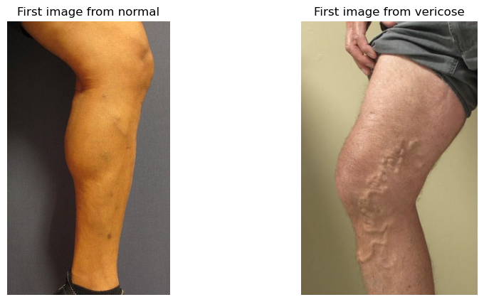
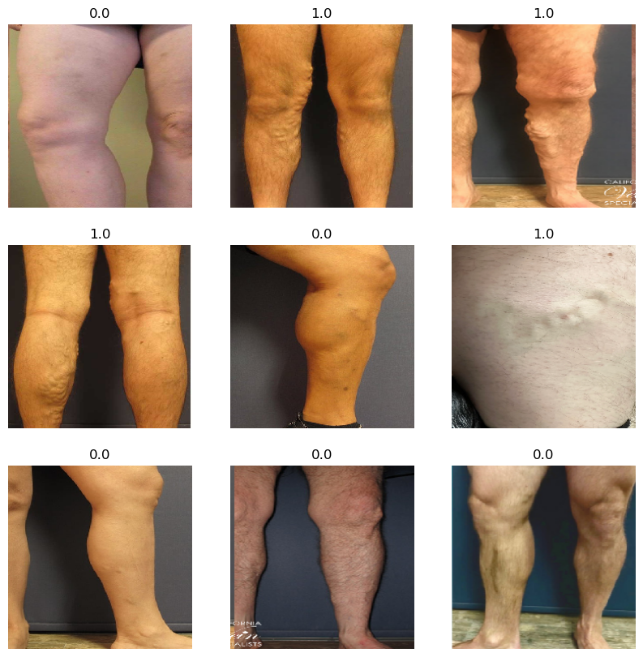
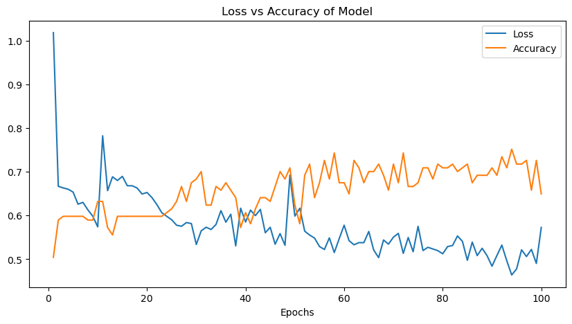
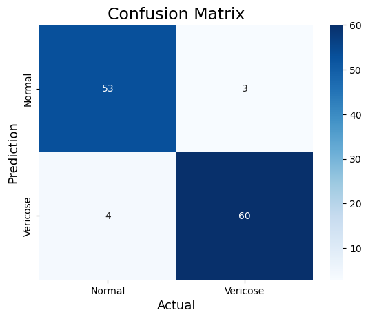

# Varicose-Detection
VaricoseDetection is an AI-powered solution designed to predict the presence of varicose veins using Convolutional Neural Networks (CNN). This project aims to assist healthcare professionals in early detection and diagnosis, reducing the reliance on invasive procedures and expediting the screening process.

🚀 Features
1. Deep Learning Model: Utilizes CNN for accurate varicose vein detection.
2. Medical Imaging Analysis: Processes vein images for pattern recognition.
3. Early Detection: Assists in identifying varicose veins at an early stage.
4. Non-Invasive Screening: Reduces the need for unnecessary medical procedures.

🔧 Technologies Used
1. Python
2. TensorFlow / PyTorch
3. OpenCV for image processing
4. NumPy & Pandas for data handling
5. CNN

🛠 Installation & Usage
1️⃣ Clone the Repository

-> git clone https://github.com/yourusername/VaricoseDetection.git

-> cd VaricoseDetection

2️⃣ Install Dependencies

-> pip install -r requirements.txt
Or manually install:
-> pip install tensorflow opencv-python numpy pandas matplotlib

3️⃣ Run the Model

-> python train.py

📌 Future Enhancements
1. Improve model accuracy with a larger dataset.
2. Develop a mobile-friendly application for real-time detection.
3. Integrate explainable AI (XAI) for better medical insights.

